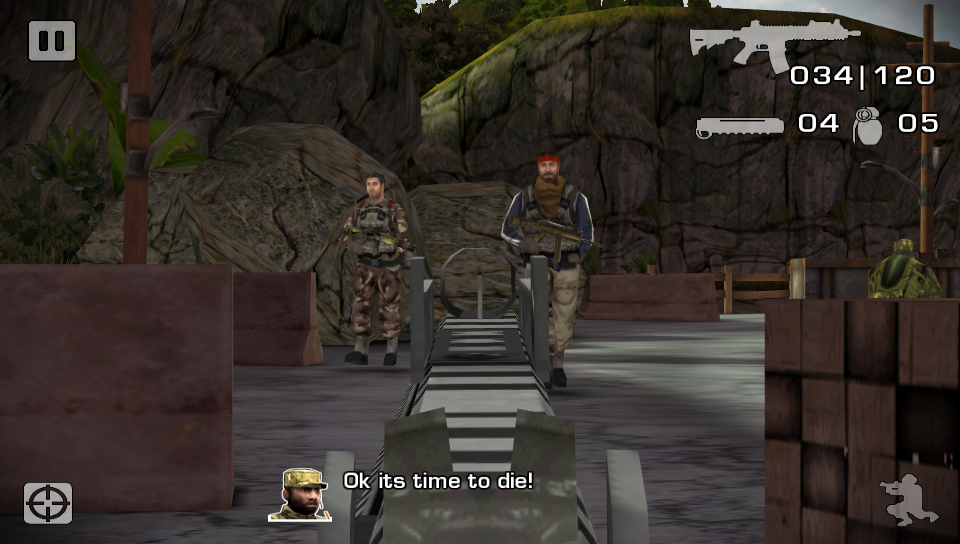

# Battlefield: Bad Company 2 Vita

This is a wrapper/port of *Battlefield: Bad Company 2 Android* for the *PS Vita*.

The port works by loading the official Android ARMv6 executable in memory, resolving its imports with native functions and patching it in order to properly run.

## Setup Instructions (For End Users)

In order to properly install the game, you'll have to follow these steps precisely:

- Obtain your copy of *Battlefield: Bad Company 2* legally from the Amazon store in form of an `.apk` file and one or more `.obb` files (usually located inside the `/sdcard/android/obb/bc2/`) folder. [You can get all the required files directly from your phone](https://stackoverflow.com/questions/11012976/how-do-i-get-the-apk-of-an-installed-app-without-root-access) or by using an apk extractor you can find in the play store. The apk can be extracted with whatever Zip extractor you prefer (eg: WinZip, WinRar, etc...) since apk is basically a zip file. You can rename `.apk` to `.zip` to open them with your default zip extractor.
- Copy the `/sdcard/android/obb/bc2/` folder to `ux0:data/bc2`.
- Open the apk and extract `libbc2.so` from the `lib/armeabi` folder to `ux0:data/bc2`.
- Install [BC2.vpk](https://github.com/TheOfficialFloW/bc2_vita/releases/download/v1.0/BC2.vpk) on your *PS Vita*.

## Build Instructions (For Developers)

Libal uses various modules and features to provide compatability with Android. Following options can be defined to alter the library behaviour:

``SYMT_HAS_PVR_PSP2_GLES1`` - application uses PVR_PSP2 GLES1 GPU driver. Application must provide following modules in app0:module: ``libgpu_es4_ext.suprx, libIMGEGL.suprx, libpvrPSP2_WSEGL.suprx, libGLESv1_CM.suprx``

``SYMT_HAS_PVR_PSP2_GLES2`` - application uses PVR_PSP2 GLES2 GPU driver. Application must provide following modules in app0:module: ``libgpu_es4_ext.suprx, libIMGEGL.suprx, libpvrPSP2_WSEGL.suprx, libGLESv2.suprx``

``SYMT_HAS_SCE_PSP2COMPAT`` - application uses ScePsp2Compat module for POSIX compatability

``SYMT_HAS_TRILITHIUM_POSIX`` - application uses Trilithium POSIX module for POSIX compatability. Application must provide following modules in app0:module: ``posix.suprx``

``LOADER_USE_CDLG`` - load .so into executable memory allocated from CDLG physical partition. Recommended to use if .so requires less than 9MB of memory and application is not using common dialog

## Credits

- Once13One for providing LiveArea assets.
